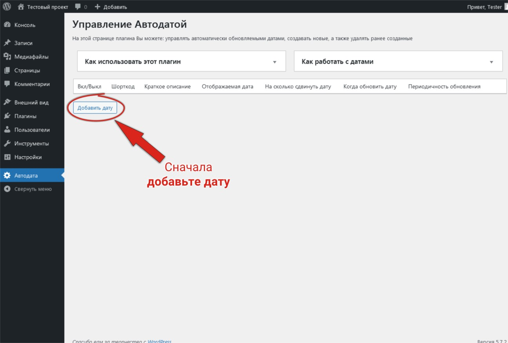
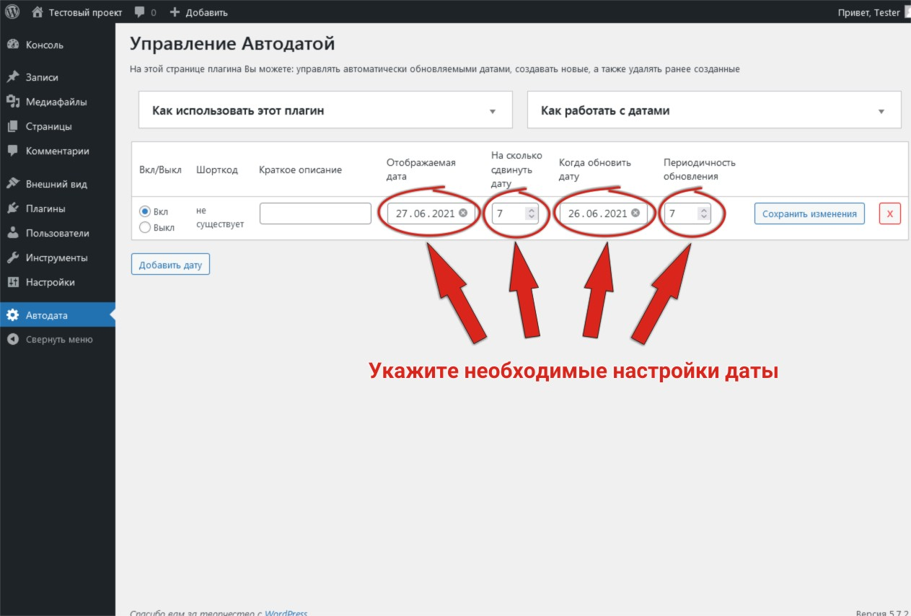
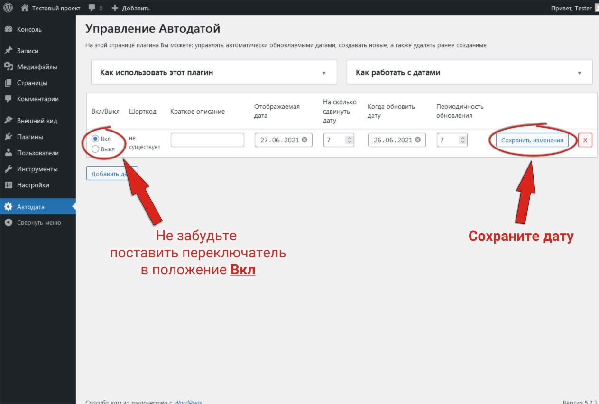
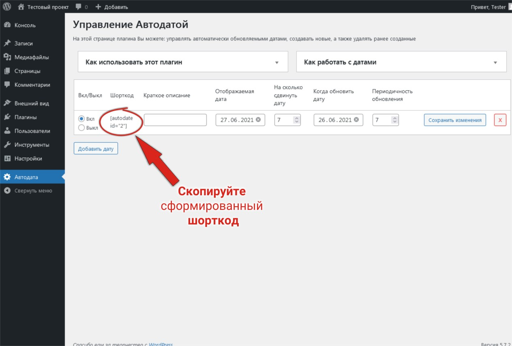
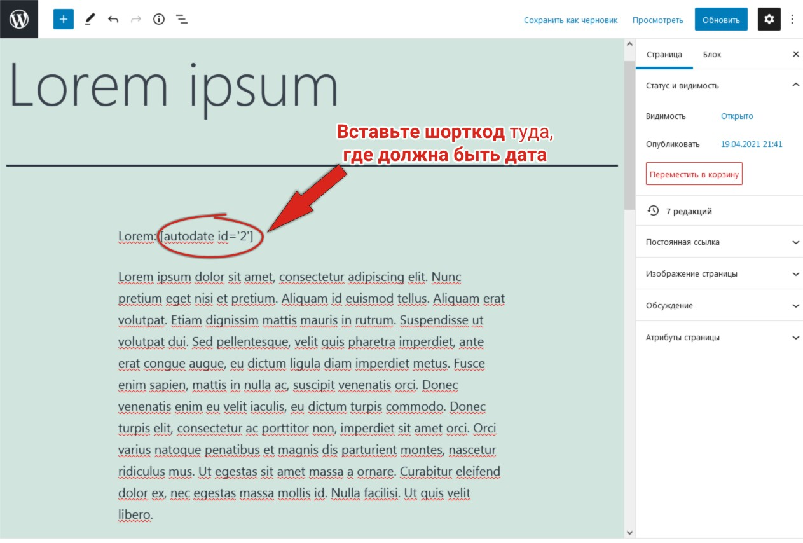
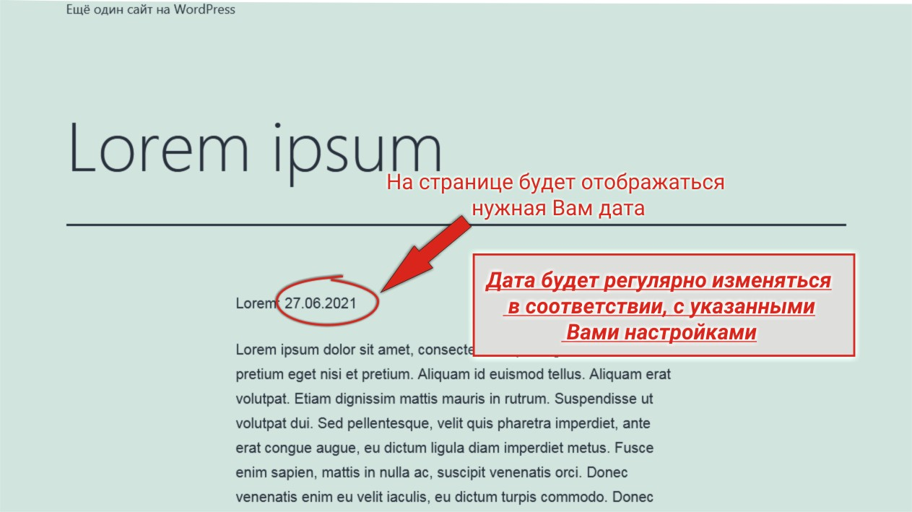

<h1>Автодата(autodate) <small>(простой плагин для wordpress)</small></h1>
<ul>
    <li><a href="#languages_in_plugin_info">Что использовано в плагине?</a></li>
    <li><a href="#expectations_for_wp_info">Требования плагина к Wordpress</a></li>
    <li><a href="#general_info">Общая информация о плагине</a>
        <ul>
            <li><a href="#plugin_usage_info">Где он может пригодиться?</a></li>
            <li><a href="#plugin_know_how_info">Как использовать плагин?</a></li>
            <li><a href="#plugin_install_info">Установка плагина</a></li>
        </ul>
    </li>
    <li><a href="#plugin_demo_in_img">Демонстрация работы плагина</a></li>
</ul>
<h2 id="languages_in_plugin_info">Что использовано в плагине?</h2>
<ol>
    <li>PHP>=7.4</li>
    <li>javascript(jQuery>=3.0)</li>
    <li>MySQL</li>
</ol>
<h2 id="expectations_for_wp_info">Требования плагина к Wordpress</h2>

Плагин протестирован со следующими версиями Wordpress:

<ul>
    <li>Мин. версия: 4.5</li>
    <li>Макс. версия: 6.0 (актуальная на момент создания readme.md (27.10.2022) )</li>
</ul>
<h2 id="general_info">Общая информация о плагине</h2>

Данный плагин делает именно, то о чём говорит его название, т.е. добавляет на страницу сайта Wordpress дату и автоматически обновляет её, исходя из заданных настроек

<h3 id="plugin_usage_info">Где он может пригодиться?</h3>

Если на Вашем сайте Wordpress указано множество дат, которые требуется регулярно обновлять, то данным плагин является идеальным решением. Например:

<ol>
    <li>Даты начала/окончания обучения в учебных центрах</li>
    <li>Даты действия скидок на определённые товары</li>
    <li>Даты организации различных общественных мероприятий</li>
    <li>и т.п.</li>
</ol>
<h3 id="plugin_know_how_info">Как использовать плагин?</h3>
<ol>
    <li>Создаёте новую дату в админ. панели плагина</li>
    <li>Определяете все необходимые настройки для неё (не забыв включить дату)</li>
    <li>Сохраняете созданную дату</li>
    <li>Копируете шорткод даты</li>
    <li>Вставляете шорткод в контент туда, где должна быть дата</li>
    <li>Забываете о необходимости постоянно менять даты в контенте</li>
</ol>

<strong>P.s.</strong> Дата на сайте отображается в том формате, которым был выбран в основных настройках Wordpress'а

<h3 id="plugin_install_info">Установка плагина</h3>

Скачать, активировать и пользоваться

<h2 id="plugin_demo_in_img">Демонстрация работы плагина</h2>

    
    
    
    
    
    

